# FinanceManager
> It is a web-based personal finance application built on Django. It allows users to add, view and analyse their expenses.


# Installation
```bash
git clone https://github.com/ihorvovchuk112/FinanceManager.git
cd FinanceManager
python -m venv venv
source venv/bin/activate   # або venv\Scripts\activate
pip install -r requirements.txt
python manage.py migrate
python manage.py runserver
```
---

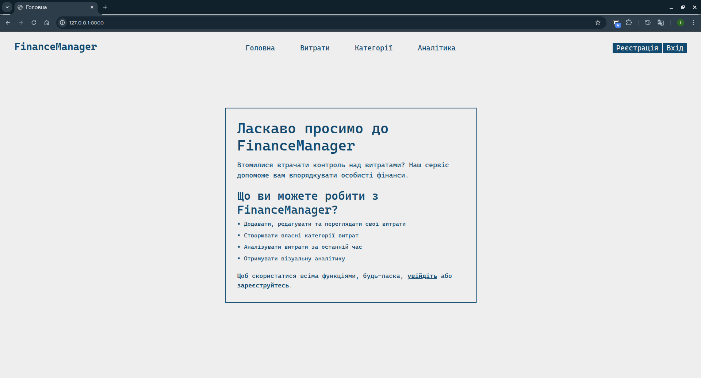
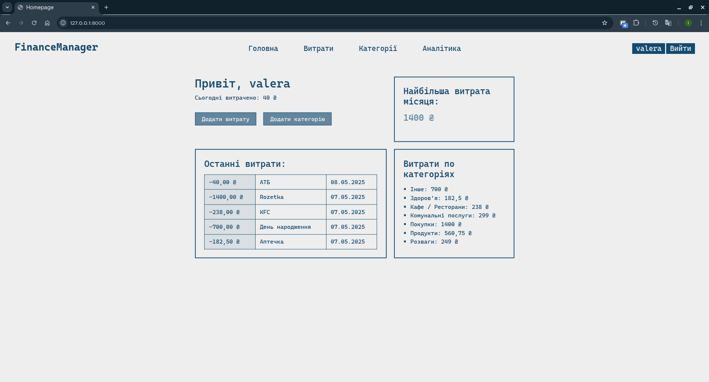
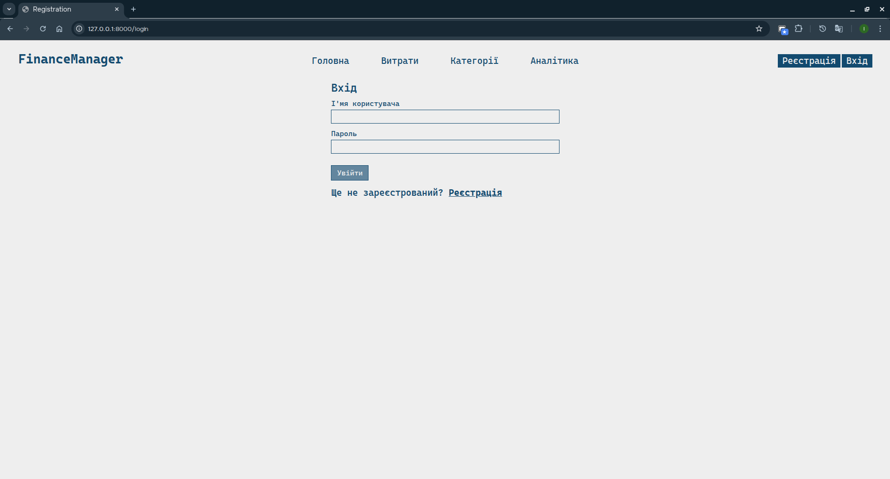
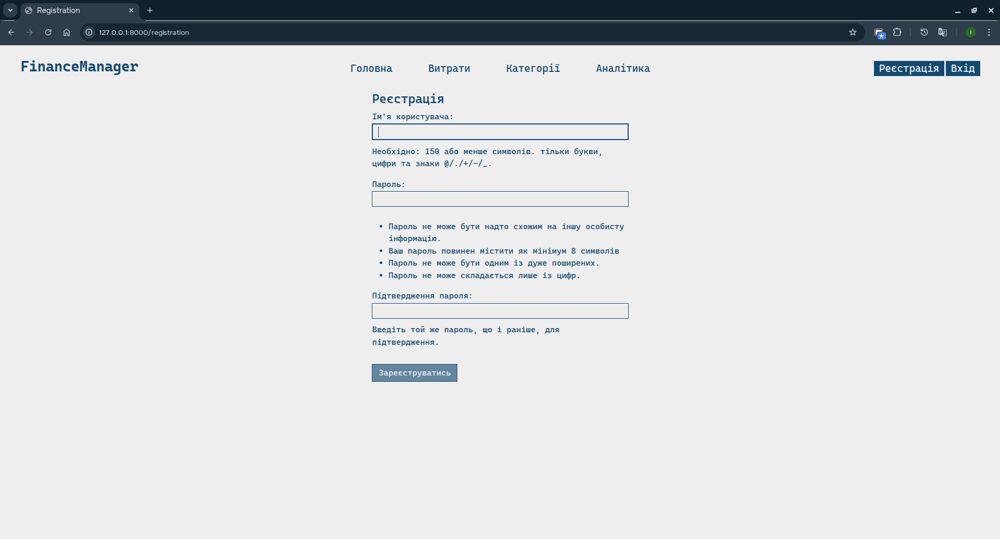
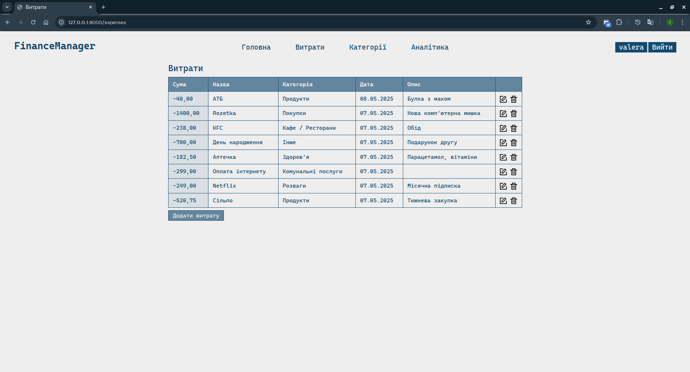
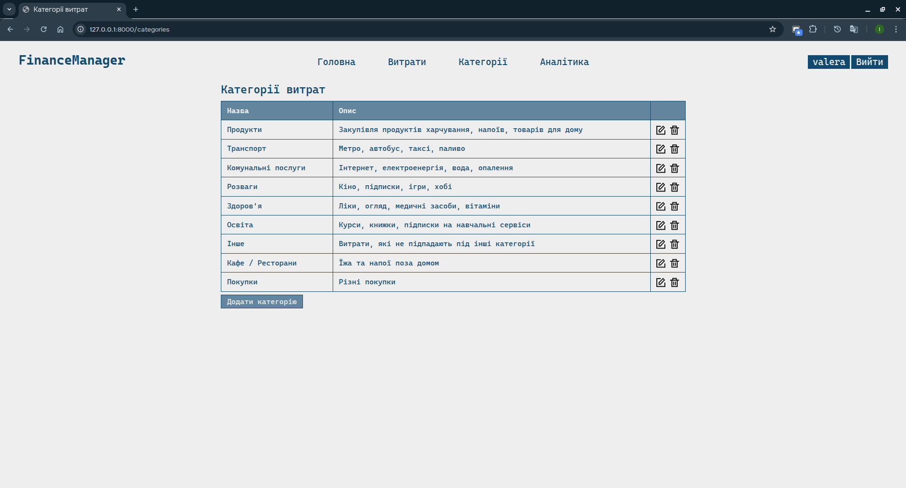
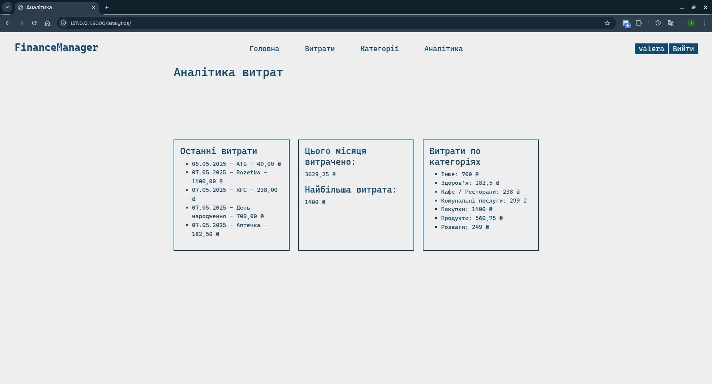
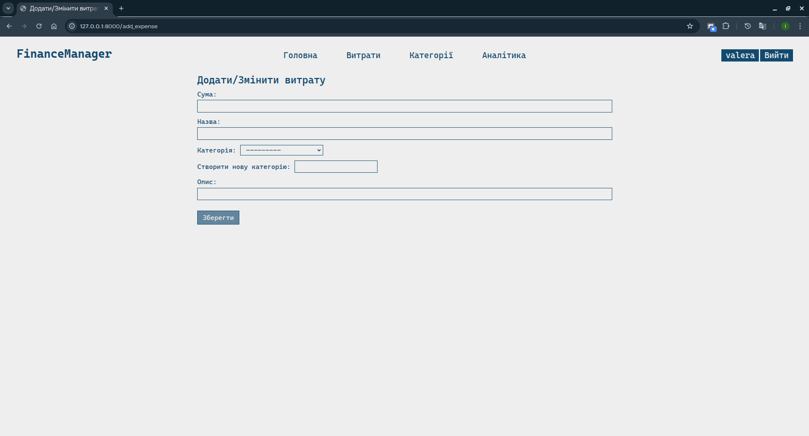
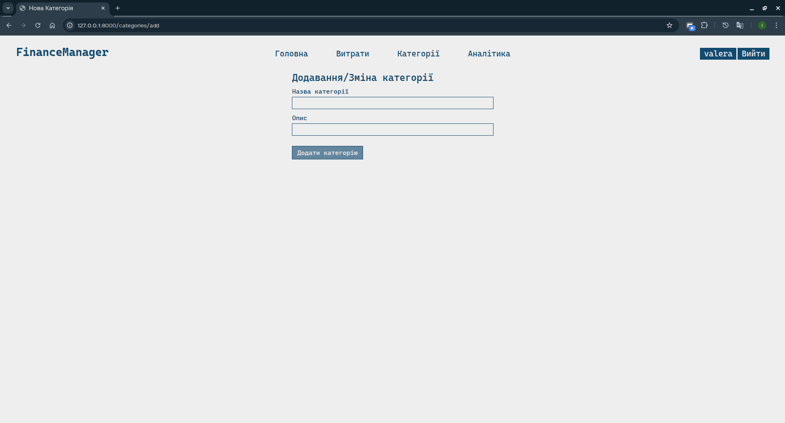
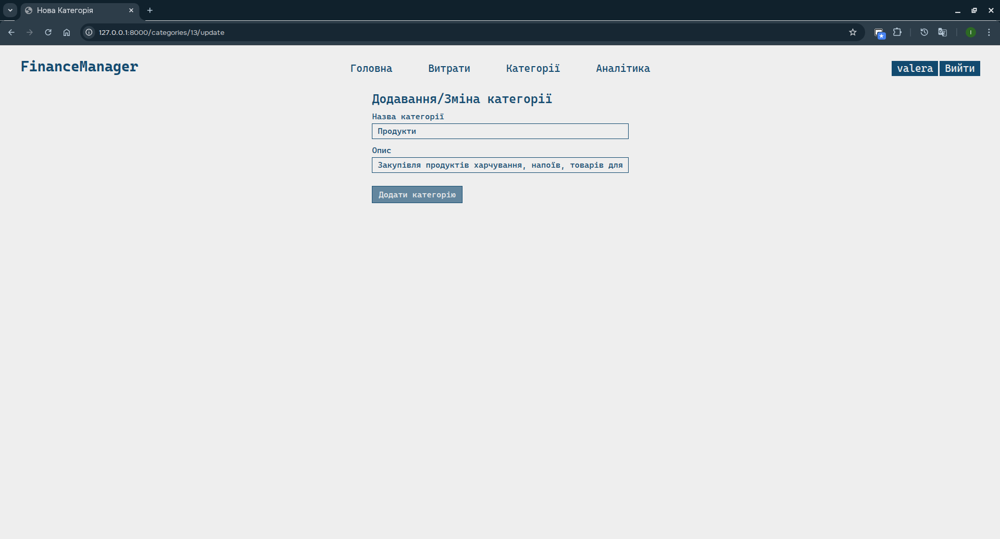
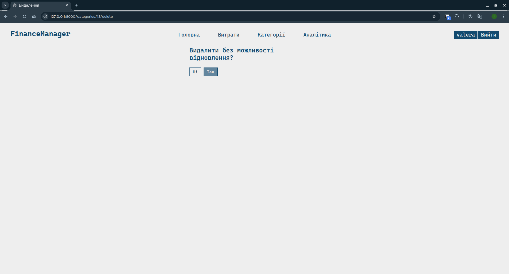
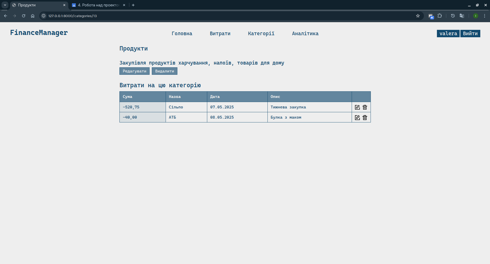
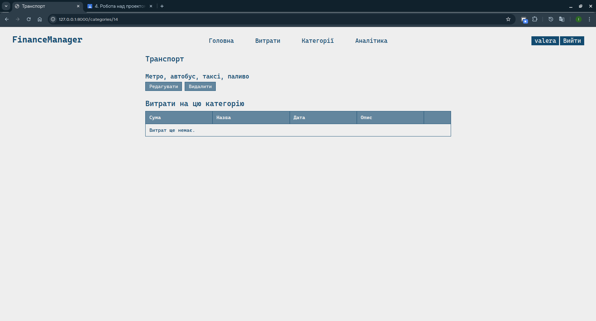
